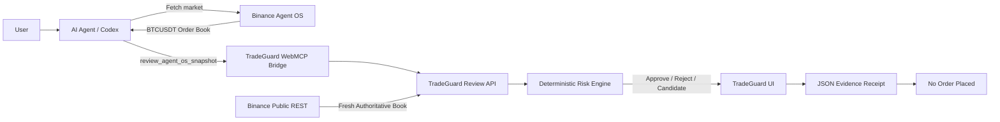

# TradeGuard

> **A deterministic pre-trade safety layer for AI trading agents, powered by Binance Agent OS.**

[](https://tradeguard-os.vercel.app)
[](https://www.binance.com/)
[](#execution-safety)

**Live Demo:** https://tradeguard-os.vercel.app  
**Repository:** https://github.com/0xNexuz/tradeguard

---

## What is TradeGuard?

AI trading agents can research markets and prepare trades faster than humans can inspect every decision.

TradeGuard inserts a deterministic safety checkpoint between an AI agent's trading intention and any future execution layer.

Instead of:

```text
AI AGENT
   ↓
TRADING IDEA
   ↓
EXECUTE
```

TradeGuard introduces:

```text
TRADING INTENT
      ↓
BINANCE AGENT OS
      ↓
LIVE BTCUSDT MARKET DATA
      ↓
TRADEGUARD
      ↓
DETERMINISTIC RISK CHECK
      ↓
APPROVE / REVISE / REJECT
      ↓
EVIDENCE RECEIPT

NO ORDER PLACED
```

TradeGuard currently focuses on one narrow question:

> **Does this proposed BTCUSDT trade satisfy the operator's risk constraints under the current Binance market?**

---

## Why TradeGuard?

Most AI trading systems focus on generating better signals.

TradeGuard focuses on a different problem:

> **What is the agent actually allowed to do with that signal?**

An AI agent can be confident while:

- requesting more capital than allowed;
- creating excessive portfolio exposure;
- consuming too much visible liquidity;
- generating unacceptable price impact;
- relying on stale or malformed market evidence.

TradeGuard moves those decisions out of the LLM and into deterministic code.

**The AI proposes. TradeGuard verifies the constraints.**

---

## Binance Agent OS Integration

TradeGuard was built for the **Binance Agent OS Mini Hackathon**.

Binance Agent OS is not a decorative integration. It provides the live market context required for TradeGuard to evaluate an agent's proposed trade.

The Agent OS workflow is:

```text
USER
  ↓
AI AGENT / CODEX
  ↓
BINANCE AGENT OS
  ↓
BTCUSDT SPOT ORDER BOOK
  ↓
review_agent_os_snapshot
  ↓
TRADEGUARD
  ↓
DETERMINISTIC RISK ENGINE
  ↓
DECISION + CANDIDATE + EVIDENCE
```

TradeGuard registers two browser tools when WebMCP is supported:

### `review_agent_os_snapshot`

Accepts a BTCUSDT order-book snapshot produced through Binance Agent OS and sends the agent request into the TradeGuard review workflow.

### `check_trading_plan`

Runs the same policy workflow using TradeGuard's server-fetched Binance public-market fallback.

---

## Agent OS Demo Prompt

Use the following prompt in an Agent OS-compatible workflow:

```text
Use Binance Agent OS to fetch the BTCUSDT Spot order book
with up to 100 levels.

Then call TradeGuard's review_agent_os_snapshot tool with
bids, asks, and lastUpdateId as updateId.

Do not place a trade.

Explain any rejection and recheck a revised amount only
if I approve it.
```

---

## Market Integrity

Agent-supplied market evidence is **not blindly trusted**.

For Agent OS review requests, TradeGuard:

1. receives the submitted market reference;
2. fetches a fresh Binance order book server-side;
3. compares the submitted top-of-book prices with the fresh Binance reference;
4. rejects the request if deviation exceeds **0.5%**;
5. performs the actual risk calculation using the server-authoritative Binance book.

This means fabricated caller-supplied depth cannot be used to manufacture an approval.

The submitted Agent OS update ID is preserved separately in the evidence receipt.

TradeGuard therefore verifies the submitted **market reference** against current Binance data.

It does **not** claim to cryptographically prove the identity of the agent client that submitted the request.

---

## Risk Engine

TradeGuard checks the proposed trade against:

- requested trade amount;
- available cash budget;
- current portfolio exposure;
- maximum allowed portfolio exposure;
- visible Binance order-book depth;
- maximum acceptable average price impact.

The risk engine is deterministic.

An LLM does not decide whether the trade passes.

The maximum candidate amount is constrained by:

```text
min(
  requested amount,
  available budget,
  remaining exposure room,
  executable visible depth inside the impact limit
)
```

The result is floored to cents.

---

## Example

Suppose an AI agent proposes:

```text
Market: BTCUSDT

Requested trade:
1,500 USDT

Available budget:
1,000 USDT

Portfolio:
3,000 USDT

Current BTC exposure:
0 USDT

Maximum BTC exposure:
25%

Maximum price impact:
0.50%
```

TradeGuard combines those constraints with a fresh Binance BTCUSDT order book.

The original request can be rejected because it violates the configured limits.

TradeGuard may then calculate a smaller candidate:

```text
REQUESTED
1,500 USDT

RESULT
REJECTED

CONSTRAINED CANDIDATE
750 USDT

CHECKS
✓ Budget
✓ Portfolio exposure
✓ Visible liquidity
✓ Average price impact

EXECUTION
No order placed
```

The candidate is **not automatically approved**.

If the user accepts the revised amount, TradeGuard performs a new review against current market data.

---

## Core Workflow

```text
1. Agent proposes a trade
        ↓
2. Binance Agent OS fetches BTCUSDT depth
        ↓
3. Snapshot enters TradeGuard
        ↓
4. Server verifies market reference
        ↓
5. Deterministic risk engine runs
        ↓
6. APPROVE / REJECT / PROPOSE REVISION
        ↓
7. User may accept revised amount
        ↓
8. TradeGuard runs a NEW review
        ↓
9. JSON evidence can be exported
        ↓
10. NO ORDER PLACED
```

---

## Core Invariants

### 1. No financial execution

TradeGuard review paths do not place, cancel or transfer orders.

There is no exchange execution client or trading credential in the current application.

Every review explicitly reports:

```text
No order placed
```

---

### 2. Invalid evidence fails closed

Malformed, stale or invalid market books cannot produce a successful review.

TradeGuard validates:

- timestamps;
- bids;
- asks;
- numeric values;
- ask ordering;
- required fields;
- market structure.

---

### 3. Limits constrain the candidate

TradeGuard cannot propose an amount above the configured:

- request;
- available budget;
- remaining portfolio exposure;
- executable visible market depth.

---

### 4. Revision requires a new review

A revised amount cannot inherit the previous review state.

```text
REJECTED
   ↓
REVISE
   ↓
FETCH / VERIFY MARKET
   ↓
RUN TRADEGUARD AGAIN
```

---

## Execution Safety

TradeGuard deliberately does **not** place trades.

The current build demonstrates the policy layer that can sit before a future Binance execution workflow.

```text
AI AGENT
   ↓
TRADEGUARD
   ↓
POLICY RESULT
   ↓

CURRENT BUILD:
STOP

FUTURE:
BINANCE CONFIRMATION
   ↓
EXECUTION
```

Any future trading integration should preserve Binance authorization and confirmation requirements.

---

## Real vs Current Scope

| Capability | Status |
|---|---|
| Binance BTCUSDT public order book | **REAL** |
| Binance Agent OS market-data workflow | **REAL / PARTIAL PROVENANCE** |
| Server-authoritative Binance verification | **REAL** |
| Deterministic risk engine | **REAL** |
| Budget checks | **REAL** |
| Portfolio exposure checks | **REAL — MANUAL INPUT** |
| Visible-depth calculation | **REAL** |
| Average price-impact calculation | **REAL** |
| Constrained candidate sizing | **REAL** |
| JSON evidence export | **REAL** |
| Public Vercel deployment | **REAL** |
| WebMCP browser integration | **IMPLEMENTED — supported browser required** |
| Binance account balance lookup | **NOT IMPLEMENTED** |
| Trade placement | **NOT IMPLEMENTED** |
| Asset transfer | **NOT IMPLEMENTED** |

TradeGuard does not represent manually entered portfolio values as authenticated Binance account data.

---

## Demo Flow

Open:

**https://tradeguard-os.vercel.app**

Recommended demonstration:

```text
1. Show TradeGuard + live URL
2. Enter a 1,500 USDT BTCUSDT trading plan
3. Binance Agent OS fetches up to 100 order-book levels
4. Agent invokes review_agent_os_snapshot
5. TradeGuard rejects the unsafe request
6. Show rejection reasons
7. Show constrained candidate such as 750 USDT
8. Recheck the revised amount
9. Export JSON evidence
10. Finish on: "No order placed"
```

The Binance Agent OS response and TradeGuard invocation should remain visually continuous in the demo.

---

## Architecture



---

## Trusted Core

The deterministic policy logic lives primarily in:

```text
lib/risk.ts
```

Market retrieval and market verification are separated from the policy calculation.

This keeps the core decision logic inspectable and testable.

---

## API

### `GET /api/market`

Retrieves a fresh Binance BTCUSDT Spot order book with up to 100 levels.

No mock market price is substituted if Binance fails.

An upstream failure therefore blocks the review rather than silently switching to fake data.

---

### `POST /api/review`

Validates the plan, retrieves current Binance market data and evaluates:

```text
budget
portfolio exposure
visible depth
average price impact
```

---

### Agent OS Review

Agent OS market evidence enters the workflow through the registered browser tool.

The backend independently compares the submitted market reference against fresh Binance market data before calculating the policy result.

---

## Evidence

TradeGuard treats evidence as part of the product.

A review can preserve:

```text
market
requested amount
budget
portfolio state
exposure limit
price-impact limit
Binance market reference
submitted update ID
review timestamp
decision
rejection reasons
constrained candidate
execution status
```

Repository evidence lives under:

```text
evidence/
├── deployments/
├── integrations/
└── tests/
```

Engineering and submission-readiness documentation lives under:

```text
docs/build-harness/
```

This includes:

```text
problem
ecosystem gap
architecture
threat model
invariants
Binance sponsor integration
real vs simulated status
test plan
evidence plan
demo plan
SDK extraction
submission map
release audit
```

---

## Run Locally

### Requirements

- Node.js 22.13+
- npm
- Node 24 recommended for the deterministic TypeScript assertions

Clone the repository:

```bash
git clone https://github.com/0xNexuz/tradeguard.git
cd tradeguard
```

Install:

```bash
npm install
```

Run:

```bash
npm run dev
```

---

## Verify

Run the full release verification:

```bash
npm run verify
```

This runs:

```text
deterministic risk tests
Agent OS endpoint tests
production build
TypeScript type checking
```

You can also run:

```bash
npm audit --audit-level=high
```

The September 8 release reports zero dependency vulnerabilities.

---

## Automated Verification

The current release includes checks covering:

- valid approval;
- budget rejection;
- exposure rejection;
- constrained candidate sizing;
- insufficient visible depth;
- excessive average price impact;
- malformed market evidence;
- stale market evidence;
- invalid numeric inputs;
- revision behavior;
- missing inputs;
- Agent OS review endpoint behavior;
- server-authoritative market verification;
- malformed Agent OS requests.

GitHub Actions runs release verification on pushes and pull requests.

---

## Security Model

TradeGuard assumes:

- AI-generated trading intentions are untrusted;
- browser/user inputs are untrusted;
- caller-supplied market snapshots require verification;
- external market infrastructure can fail;
- missing or invalid evidence must fail closed.

Important limitations:

- portfolio values are currently entered manually;
- account balances are not authenticated through Binance;
- Agent OS caller identity is not cryptographically attested;
- server receipt time is not Binance matching-engine event time;
- price-impact calculations exclude fees and future market movement;
- passing TradeGuard does not guarantee execution quality or returns;
- the application's minimum trade amount is not presented as a verified Binance lot-size rule.

---

## Threat Model

TradeGuard is designed to detect, reject or constrain situations such as:

```text
oversized trade requests
budget violations
excessive portfolio exposure
insufficient market depth
excessive price impact
malformed order books
stale evidence
manipulated caller-supplied market references
invalid numeric values
unsafe revision inheritance
```

The governing principle is:

> **If the evidence required to justify an agent action cannot be verified, the action should not receive a passing review.**

---

## Project Structure

```text
tradeguard/
│
├── app/                     # UI + application routes
├── api/                     # Hosting API adapters
│
├── lib/
│   ├── market.ts            # Binance market retrieval
│   └── risk.ts              # Deterministic policy engine
│
├── tests/                   # Automated policy/API tests
│
├── evidence/
│   ├── deployments/
│   ├── integrations/
│   └── tests/
│
├── docs/
│   └── build-harness/       # Architecture, threats, tests and submission audit
│
└── README.md
```

---

## Binance Agent OS Hackathon

TradeGuard was built for the **Binance Agent OS Mini Hackathon**.

### Primary direction

**Track A — Build an AI agent with Agent OS**

The project demonstrates how Binance Agent OS can provide live market intelligence to an autonomous workflow while a separate deterministic policy engine constrains what the agent is allowed to propose.

The Binance integration is load-bearing:

> **Without fresh Binance market evidence, TradeGuard cannot issue a market-grounded review.**

---

## Why Agent OS Matters

TradeGuard is not simply a Binance API dashboard.

Agent OS enables the AI agent itself to obtain live market context and participate in the risk-review workflow.

```text
USER INTENT
     ↓
AI AGENT
     ↓
BINANCE AGENT OS
     ↓
LIVE MARKET CONTEXT
     ↓
TRADEGUARD POLICY ENGINE
     ↓
CONSTRAINED AGENT ACTION
```

The result is an agent that can reason about a trade while still being constrained by deterministic financial rules.

---

## Design Principle

LLMs are useful for:

```text
reasoning
planning
interpreting requests
generating trade ideas
explaining results
```

They should not be the only authority deciding whether capital may move.

TradeGuard separates:

```text
AI REASONING
     ↓
TRADING INTENT

from

DETERMINISTIC POLICY
     ↓
FINANCIAL AUTHORIZATION
```

That separation is the core of the project.

---

## Current Release

The September 8 release includes:

- fresh server-authoritative Binance verification;
- maximum 0.5% submitted top-of-book deviation;
- deterministic maximum sizing;
- 15 deterministic policy checks;
- 3 Agent OS endpoint checks;
- TypeScript verification;
- production build verification;
- dependency audit with zero reported vulnerabilities;
- GitHub Actions CI;
- public Vercel deployment;
- explicit no-execution receipts.

---

## Limitations

TradeGuard is currently a pre-trade policy and evidence system.

It does not:

- execute Binance orders;
- transfer funds;
- access authenticated Binance balances;
- claim guaranteed trading performance;
- provide financial advice;
- cryptographically prove Agent OS caller identity.

These boundaries are deliberate and documented.

---

## Future Direction

TradeGuard can evolve into a reusable safety primitive for autonomous financial agents:

```text
@tradeguard/core
```

Potential future integrations include:

- authenticated account state;
- broader Binance markets;
- persistent policy profiles;
- execution adapters;
- signed/attested agent provenance;
- additional deterministic financial constraints;
- portfolio-level agent policies;
- reusable SDK/API integrations.

The fundamental architecture remains:

```text
AGENT
  ↓
MARKET EVIDENCE
  ↓
DETERMINISTIC POLICY
  ↓
AUTHORIZED / CONSTRAINED ACTION
```

---

# TradeGuard

### **Stop. Explain. Revise. Then execute.**

**Live Demo:**  
https://tradeguard-os.vercel.app

**GitHub:**  
https://github.com/0xNexuz/tradeguard

> **The current TradeGuard build never places an order.**
