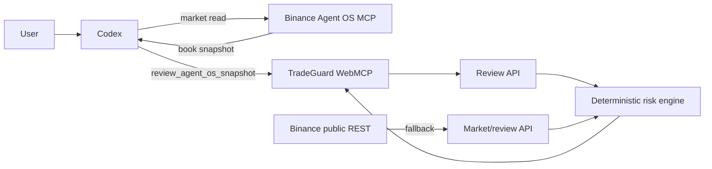

# Architecture

## System Thesis

Codex uses Binance Agent OS to retrieve a BTCUSDT order book, then calls TradeGuard's page-scoped `review_agent_os_snapshot` tool. A pure risk engine validates the book and plan, computes visible-depth price impact, and returns a review; no component has order authority.

## Components

| Component | Responsibility | Trust |
|---|---|---|
| React UI | Collect plan limits, display result, export receipt | User-controlled |
| WebMCP bridge | Accept Agent OS snapshot and update visible state | Semi-trusted |
| Sites/Vercel API adapters | Validate payload and invoke engine | Operator-controlled |
| `lib/risk.ts` | Deterministic validation and calculation | Trusted core |
| Binance public REST fallback | Server-fetched order book | External |
| Binance Agent OS MCP | Agent-fetched order book | External |
| Vercel/Sites | Host UI and APIs | External infrastructure |

## Diagram



## Critical Flows

### Agent OS review

1. User sets the visible plan and constraints.
2. Codex reads a live BTCUSDT book through Binance MCP.
3. Codex passes bid, asks and update ID into the page tool.
4. Server stamps receipt time and the engine returns pass/reject plus candidate.

Expected: the UI and tool result agree. Failure: invalid snapshots return HTTP 400 and no review.

### Server-fetched fallback

1. Browser posts the plan.
2. Server retrieves 100 Spot ask levels.
3. Engine validates freshness and computes the review.
4. Failure to retrieve or validate data returns 503; mock prices are never substituted.

## State Model

```text
READY -> CHECKING -> REJECTED -> REVISED -> CHECKING -> VERIFIED
                    \-> ERROR
VERIFIED --15 seconds--> EXPIRED
```

## Constraints and Failure Paths

The engine must remain pure, execution-free and fail closed on invalid/stale books. Binance, Vercel or Sites outages block review. At scale, upstream rate limits and stateless function concurrency will degrade before the pure calculation. No benchmark exists.
